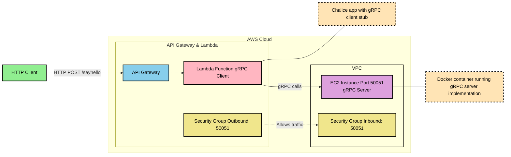

```
grpc-chalice
├── Dockerfile
├── __pycache__
│   ├── app.cpython-312.pyc
│   ├── greeting_pb2.cpython-312.pyc
│   └── greeting_pb2_grpc.cpython-312.pyc
├── app.py
├── chalicelib
│   ├── __init__.py
│   ├── __pycache__
│   │   ├── __init__.cpython-312.pyc
│   │   ├── greeting_pb2.cpython-312.pyc
│   │   └── greeting_pb2_grpc.cpython-312.pyc
│   ├── greeting_pb2.py
│   └── greeting_pb2_grpc.py
├── greeting.proto
├── requirements.txt
├── server.py
└── setup.py

```


config.json
```json
{
  "version": "2.0",
  "app_name": "grpc-chalice",
  "stages": {
    "dev": {
      "lambda_function": {
        "image_uri": "1234567898.dkr.ecr.us-east-1.amazonaws.com/grpc-hello-service:latest"
      },
      "api_gateway_stage": "api"
    }
  }
}

```

greeting.proto
```proto
syntax = "proto3";

package greeting;

service Greeter {
    rpc SayHello (HelloRequest) returns (HelloResponse) {}
}

message HelloRequest {
    string name = 1;
}

message HelloResponse {
    string message = 1;
}
```
```python
python3 -m grpc_tools.protoc -I. --python_out=chalicelib chalicelib/greeting.proto
```
server.py
```python
import grpc
from concurrent import futures
from chalicelib import greeting_pb2
from chalicelib import greeting_pb2_grpc

class GreeterServicer(greeting_pb2_grpc.GreeterServicer):
    def SayHello(self, request, context):
        return greeting_pb2.HelloReply(message=f"Hello, {request.name}")

def serve():
    server = grpc.server(futures.ThreadPoolExecutor(max_workers=10))
    greeting_pb2_grpc.add_GreeterServicer_to_server(GreeterServicer(), server)
    server.add_insecure_port('[::]:50051')  # Run on port 50051
    print("Server running on port 50051")
    server.start()
    server.wait_for_termination()

if __name__ == "__main__":
    serve()

```


app.py
```python
from chalice import Chalice, Response
import grpc
from chalicelib import greeting_pb2_grpc, greeting_pb2

app = Chalice(app_name="grpc-chalice")

GRPC_HOST = "ec2-18-109-70-15.compute-1.amazonaws.com"  # Update if running externally
GRPC_PORT = 50051

@app.route("/")
def index():
    return {"message": "Welcome to the gRPC-Chalice service!"}

@app.route("/sayhello", methods=["POST"])
def say_hello():

    # Extract data from JSON payload
    request = app.current_request
    name = request.json_body.get("name", "")

    # Connect to gRPC Server
    with grpc.insecure_channel(f"{GRPC_HOST}:{GRPC_PORT}") as channel:
        stub = greeting_pb2_grpc.GreeterStub(channel)
        response = stub.SayHello(greeting_pb2.HelloRequest(name=name))
        return Response(body={"message": response.message},
                        status_code=200)


```
setup.py
```python
from setuptools import setup, find_packages

setup(
    name="grpc-chalice",
    version="1.0.0",
    packages=find_packages(include=['chalicelib', 'chalicelib.*']),
    include_package_data=True,
    install_requires=[
        "grpcio>=1.68.1",
        "protobuf>=5.29.2"
    ],
)
```
requirements.txt
```txt
grpcio==1.68.1
grpcio-tools==1.68.1
protobuf==5.29.2
setuptools==75.6.0
```
Dockerfile
```Dockerfile
FROM python:3.12-slim

# RUN pip install grpcio grpcio-tools protobuf

# Copy server files
COPY server.py /app/
COPY chalicelib/* /app/chalicelib/
WORKDIR /app

# Copy the app files into the container
COPY . .

# Install required Python packages
RUN pip install --no-cache-dir -r requirements.txt

# Expose the necessary port (gRPC will run on 50051)
EXPOSE 50051

# Expose Chalice server port (for local testing, or add more logic if needed)
EXPOSE 8000

# Command to run the gRPC server
CMD ["python", "server.py"]
```

```shell
chalice deploy --profile local

Creating deployment package.
Updating policy for IAM role: grpc-chalice-dev
Updating lambda function: grpc-chalice-dev
Updating rest API
Resources deployed:
  - Lambda ARN: arn:aws:lambda:us-east-1:396608797019:function:grpc-chalice-dev
  - Rest API URL: https://5zfqodutl9.execute-api.us-east-1.amazonaws.com/api/


```

```shell
ubuntu@ip-172-31-18-96:~$ docker run -p 50051:50051 123456789.dkr.ecr.us-east-1.amazonaws.com/grpc-hello-service:latest
```


```shell

ubuntu@ip-172-31-18-96:~$ docker exec -it b11306b9aff5 /bin/bash
root@b11306b9aff5:/app# ps -ef
UID          PID    PPID  C STIME TTY          TIME CMD
root           1       0  0 Dec28 ?        00:00:35 python server.py
root         201       0  0 Dec28 pts/0    00:00:00 /bin/bash
root         692       1  0 Dec28 pts/0    00:00:00 [python3.12] <defunct>
root         817       0  0 05:03 pts/1    00:00:00 /bin/bash
root         823     817  0 05:03 pts/1    00:00:00 ps -ef
root@b11306b9aff5:/app# cat server.py
import grpc
from concurrent import futures
import greeting_pb2
import greeting_pb2_grpc
from grpc_reflection.v1alpha import reflection

# Define the service implementation
class Greeter(greeting_pb2_grpc.GreeterServicer):
    def SayHello(self, request, context):
        # Return a HelloReply message
        return greeting_pb2.HelloReply(message=f"Hello {request.name}!")

# Initialize the server
def serve():
    server = grpc.server(futures.ThreadPoolExecutor(max_workers=10))
    greeting_pb2_grpc.add_GreeterServicer_to_server(Greeter(), server)

    # Enable reflection for the server
    SERVICE_NAMES = (
        greeting_pb2.DESCRIPTOR.services_by_name['Greeter'].full_name,
    )
    reflection.enable_server_reflection(SERVICE_NAMES, server)

    server.add_insecure_port('[::]:50051')  # Bind to port 50051
    server.start()
    print('Server running on port 50051')
    server.wait_for_termination()

if __name__ == '__main__':
    serve()

root@b11306b9aff5:/app#
```


Testing:
```shell
(base) whatever@Angelines-MacBook-Pro grpc-dec-28 % curl --location 'https://5zfqodutl8.execute-api.us-east-1.amazonaws.com/api/sayhello' \
--header 'Content-Type: application/json' \
--header 'x-api-key: weMt1YrCdpiVSHzbmUtx686Q1Av3TomapK91tKr2' \
--data '{
    "name": "Able to integrate chalice"
}'

{"message":"Hello, Able to integrate chalice"}%  

```
