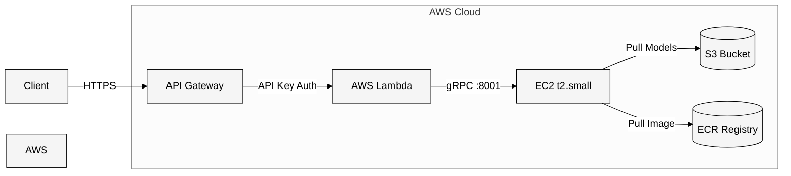

# Triton Inference Server with AWS Lambda Integration

A complete solution for deploying NVIDIA Triton Inference Server on AWS EC2 with a serverless API interface using AWS Lambda and Chalice framework.

## Architecture



## Prerequisites

- AWS Account with appropriate permissions
- AWS CLI configured
- Docker installed
- Python 3.x
- S3 bucket for model storage

## Project Structure

```
models/
└── densenet_onnx
    ├── 1
    │   ├── config.pbtxt
    │   └── model.onnx
    └── densenet_labels.txt

triton-grpc-app/
├── app.py
├── requirements.txt
└── .chalice/
    └── config.json
```

## Setup Instructions

### 1. Docker Image Setup

```bash
# Pull NVIDIA Triton Server image
docker pull nvcr.io/nvidia/tritonserver:24.11-py3

# Tag for ECR
docker tag nvcr.io/nvidia/tritonserver:24.11-py3 <account_id>.dkr.ecr.us-east-1.amazonaws.com/triton-grpc:24.11-py3

# Push to ECR
docker push <account_id>.dkr.ecr.us-east-1.amazonaws.com/triton-grpc:24.11-py3
```

### 2. EC2 Configuration

1. Launch t2.small instance with 24GB EBS
2. Configure security group to allow inbound traffic on port 8001 (gRPC)
3. Run Triton server:

```bash
docker run --rm -p 8000:8000 -p 8001:8001 -p 8002:8002 \
    <acct_id>.dkr.ecr.us-east-1.amazonaws.com/triton-grpc:24.11-py3 \
    tritonserver --model-repository=s3://dry-bean-bucket-c/models
```

### 3. Chalice Application Setup

1. Create new project:
```bash
chalice new-project triton-grpc-app
cd triton-grpc-app
```

2. Create requirements.txt:
```
chalice
numpy
tritonclient[grpc]
```

3. Configure .chalice/config.json:
```json
{
  "version": "2.0",
  "app_name": "triton-grpc-app",
  "stages": {
    "dev": {
      "api_gateway_stage": "api"
    }
  }
}
```

4. Create app.py:
```python
from chalice import Chalice
import numpy as np
import tritonclient.grpc as grpcclient
from tritonclient.utils import np_to_triton_dtype

app = Chalice(app_name='triton-grpc-app')

# Server configuration
TRITON_GRPC_URL = "ec2-xx-xx-xx-xx.compute-1.amazonaws.com:8001"  # Replace with your host
MODEL_NAME = "densenet_onnx"
INPUT_NAME = "data_0"
OUTPUT_NAME = "fc6_1"
INPUT_SHAPE = [1, 3, 224, 224]

@app.route('/infer', methods=['POST'])
def infer():
    try:
        # Initialize client
        triton_client = grpcclient.InferenceServerClient(url=TRITON_GRPC_URL)

        # Prepare input data
        input_data = np.random.rand(*INPUT_SHAPE).astype(np.float32)
        inputs = [
            grpcclient.InferInput(INPUT_NAME, INPUT_SHAPE,
                                  np_to_triton_dtype(input_data.dtype))
        ]
        inputs[0].set_data_from_numpy(input_data)

        # Define outputs
        outputs = [grpcclient.InferRequestedOutput(OUTPUT_NAME)]

        # Make inference request
        response = triton_client.infer(
            model_name=MODEL_NAME,
            inputs=inputs,
            outputs=outputs
        )

        output_data = response.as_numpy(OUTPUT_NAME)

        return {
            'status': 'success',
            'output': output_data.tolist()
        }

    except Exception as e:
        return {
            'status': 'error',
            'message': str(e)
        }

@app.route('/health', methods=['GET'])
def health():
    try:
        triton_client = grpcclient.InferenceServerClient(url=TRITON_GRPC_URL)
        if triton_client.is_server_live():
            return {'status': 'healthy'}
        return {'status': 'unhealthy'}
    except Exception as e:
        return {'status': 'unhealthy', 'error': str(e)}
```

5. Deploy the application:
```bash
chalice deploy --profile local
```

## API Usage

### Health Check
```bash
curl https://gm9b8nx3d8.execute-api.us-east-1.amazonaws.com/api/health
```

Expected response:
```json
{"status": "healthy"}
```

### Inference
```bash
curl https://gm9b8nx3d8.execute-api.us-east-1.amazonaws.com/api/infer \
--header 'Content-Type: application/json' \
--header 'x-api-key: YOUR_API_KEY' \
--data '{
    "name": "Test inference"
}'
```

Example response:
```json
{
    "status": "success",
    "output": [[[-1.0031218528747559], [-0.9455380439758301], ...]]
}
```

## Security Features

- API Gateway authentication using API keys
- EC2 security group limiting access to gRPC port (8001)
- IAM roles controlling service access
- S3 bucket policies for model access
- ECR repository policies

## Performance Considerations

1. EC2 Instance:
   - Monitor resource usage
   - Consider auto-scaling for production
   - Adjust instance type based on load

2. Lambda Function:
   - Optimize memory allocation
   - Implement connection pooling
   - Consider caching responses

3. Model Serving:
   - Configure model concurrency
   - Monitor inference latency
   - Consider batch processing

## Monitoring

1. CloudWatch Integration:
   - Lambda function logs
   - EC2 metrics
   - API Gateway access logs

2. Health Checks:
   - Endpoint availability
   - Error rates
   - Response times

## Known Limitations

- Fixed input shape
- Single model support
- Basic error handling
- No auto-scaling configuration
- Limited request validation

## Future Improvements

1. Technical:
   - Multiple model version support
   - Input preprocessing
   - Enhanced validation
   - Better error handling

2. Operational:
   - Auto-scaling setup
   - Advanced monitoring
   - Response caching
   - Load balancing

3. Security:
   - VPC integration
   - Enhanced authentication
   - Request encryption

## Troubleshooting

Common issues and solutions:

1. Connection Timeouts:
   - Check EC2 security groups
   - Verify Lambda execution role
   - Test direct gRPC connection

2. Memory Errors:
   - Increase Lambda memory
   - Monitor EC2 resources
   - Check input data size

3. Model Loading Failures:
   - Verify S3 permissions
   - Check model repository structure
   - Validate model configuration

## Contributing

1. Fork the repository
2. Create a feature branch
3. Submit a pull request

## License

[Add your chosen license]

## Support

- Open an issue in the repository
- Contact the maintainers
- Check documentation

---
*Last Updated: December 2024*
