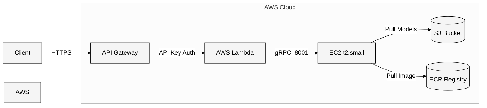

# Triton Inference Server with AWS Lambda Integration

A complete solution for deploying NVIDIA Triton Inference Server on AWS EC2 with a serverless API interface using AWS Lambda and Chalice framework.

## Architecture



## Prerequisites

- AWS Account with appropriate permissions
- AWS CLI configured
- Docker installed
- Python 3.x
- S3 bucket for model storage

## Project Structure

```
models/
└── densenet_onnx
    ├── 1
    │   ├── config.pbtxt
    │   └── model.onnx
    └── densenet_labels.txt

triton-grpc-app/
├── app.py
├── requirements.txt
└── .chalice/
    └── config.json
```

## Setup Instructions

### 1. Docker Image Setup

```bash
# Pull NVIDIA Triton Server image
docker pull nvcr.io/nvidia/tritonserver:24.11-py3

# Tag for ECR
docker tag nvcr.io/nvidia/tritonserver:24.11-py3 <account_id>.dkr.ecr.us-east-1.amazonaws.com/triton-grpc:24.11-py3

# Push to ECR
docker push <account_id>.dkr.ecr.us-east-1.amazonaws.com/triton-grpc:24.11-py3
```

### 2. EC2 Configuration

1. Launch t2.small instance with 24GB EBS
2. Configure security group to allow inbound traffic on port 8001 (gRPC)
3. Run Triton server:

```bash
docker run --rm -p 8000:8000 -p 8001:8001 -p 8002:8002 \
    <acct_id>.dkr.ecr.us-east-1.amazonaws.com/triton-grpc:24.11-py3 \
    tritonserver --model-repository=s3://dry-bean-bucket-c/models
```

### 3. Chalice Application Setup

1. Create new project:
```bash
chalice new-project triton-grpc-app
cd triton-grpc-app
```

2. Create requirements.txt:
```
chalice
numpy
tritonclient[grpc]
```

3. Configure .chalice/config.json:
```json
{
  "version": "2.0",
  "app_name": "triton-grpc-app",
  "stages": {
    "dev": {
      "api_gateway_stage": "api"
    }
  }
}
```

4. Create app.py:
```python
from chalice import Chalice
import numpy as np
import tritonclient.grpc as grpcclient
from tritonclient.utils import np_to_triton_dtype

app = Chalice(app_name='triton-grpc-app')

# Server configuration
TRITON_GRPC_URL = "ec2-xx-xx-xx-xx.compute-1.amazonaws.com:8001"  # Replace with your host
MODEL_NAME = "densenet_onnx"
INPUT_NAME = "data_0"
OUTPUT_NAME = "fc6_1"
INPUT_SHAPE = [1, 3, 224, 224]

@app.route('/infer', methods=['POST'])
def infer():
    try:
        # Initialize client
        triton_client = grpcclient.InferenceServerClient(url=TRITON_GRPC_URL)

        # Prepare input data
        input_data = np.random.rand(*INPUT_SHAPE).astype(np.float32)
        inputs = [
            grpcclient.InferInput(INPUT_NAME, INPUT_SHAPE,
                                  np_to_triton_dtype(input_data.dtype))
        ]
        inputs[0].set_data_from_numpy(input_data)

        # Define outputs
        outputs = [grpcclient.InferRequestedOutput(OUTPUT_NAME)]

        # Make inference request
        response = triton_client.infer(
            model_name=MODEL_NAME,
            inputs=inputs,
            outputs=outputs
        )

        output_data = response.as_numpy(OUTPUT_NAME)

        return {
            'status': 'success',
            'output': output_data.tolist()
        }

    except Exception as e:
        return {
            'status': 'error',
            'message': str(e)
        }

@app.route('/health', methods=['GET'])
def health():
    try:
        triton_client = grpcclient.InferenceServerClient(url=TRITON_GRPC_URL)
        if triton_client.is_server_live():
            return {'status': 'healthy'}
        return {'status': 'unhealthy'}
    except Exception as e:
        return {'status': 'unhealthy', 'error': str(e)}
```

5. Deploy the application:
```bash
chalice deploy --profile local
```

## API Usage

### Health Check
```bash
curl https://gm9b8nx3d8.execute-api.us-east-1.amazonaws.com/api/health
```

Expected response:
```json
{"status": "healthy"}
```

### Inference
```bash
curl https://gm9b8nx3d8.execute-api.us-east-1.amazonaws.com/api/infer \
--header 'Content-Type: application/json' \
--header 'x-api-key: YOUR_API_KEY' \
--data '{
    "name": "Test inference"
}'
```

Example response:
```json
{
    "status": "success",
    "output": [[[-1.0031218528747559], [-0.9455380439758301], ...]]
}
```


# For Multi Model without S3 Implementation
```python
from chalice import Chalice, Response
import numpy as np
import tritonclient.grpc as grpcclient
from tritonclient.utils import np_to_triton_dtype

app = Chalice(app_name='triton-grpc-app')

# Server configuration
TRITON_GRPC_URL = "ec2-xx-xx-xx-xx.compute-1.amazonaws.com:8001"

# Model configurations
MODEL_CONFIGS = {
    "densenet": {
        "name": "densenet_onnx",
        "input_name": "data_0",
        "output_name": "fc6_1",
        "input_shape": [1, 3, 224, 224]
    },
    "resnet50": {
        "name": "resnet50_onnx",
        "input_name": "data",
        "output_name": "resnetv24_dense0_fwd",
        "input_shape": [1, 3, 224, 224]
    },
    "chrisnet": {
        "name": "densenet_onnx",
        "input_name": "data_0",
        "output_name": "fc6_1",
        "input_shape": [1, 3, 224, 224]
    }
}

def preprocess_image(raw_input, shape):
    """
    Placeholder for image preprocessing.
    In real application, this would handle actual image data.
    """
    return np.random.rand(*shape).astype(np.float32)

@app.route('/infer/{model_type}', methods=['POST'])
def infer(model_type):
    if model_type not in MODEL_CONFIGS:
        return Response(
            body={'error': f'Model {model_type} not supported. Available models: {list(MODEL_CONFIGS.keys())}'},
            status_code=400
        )

    try:
        model_config = MODEL_CONFIGS[model_type]

        # Initialize client
        triton_client = grpcclient.InferenceServerClient(url=TRITON_GRPC_URL)

        # Prepare input data
        input_data = preprocess_image(None, model_config["input_shape"])
        inputs = [
            grpcclient.InferInput(
                model_config["input_name"],
                model_config["input_shape"],
                np_to_triton_dtype(input_data.dtype)
            )
        ]
        inputs[0].set_data_from_numpy(input_data)

        # Define outputs
        outputs = [grpcclient.InferRequestedOutput(model_config["output_name"])]

        # Make inference request
        response = triton_client.infer(
            model_name=model_config["name"],
            inputs=inputs,
            outputs=outputs
        )

        output_data = response.as_numpy(model_config["output_name"])

        return {
            'status': 'success',
            'model': model_type,
            'output': output_data.tolist()
        }

    except Exception as e:
        return Response(
            body={
                'status': 'error',
                'model': model_type,
                'message': str(e)
            },
            status_code=500
        )

@app.route('/models', methods=['GET'])
def list_models():
    try:
        triton_client = grpcclient.InferenceServerClient(url=TRITON_GRPC_URL)
        model_repository = triton_client.get_model_repository_index()
        return {
            'status': 'success',
            'models': [model.name for model in model_repository.models]
        }
    except Exception as e:
        return Response(
            body={
                'status': 'error',
                'message': str(e)
            },
            status_code=500
        )

@app.route('/health', methods=['GET'])
def health():
    try:
        triton_client = grpcclient.InferenceServerClient(url=TRITON_GRPC_URL)
        if triton_client.is_server_live():
            return {'status': 'healthy'}
        return {'status': 'unhealthy'}
    except Exception as e:
        return {'status': 'unhealthy', 'error': str(e)}
```

S3 Structure
```
S3://dry-bean-bucket-c/

dry-bean-bucket-c/
├── models/                           # Model repository
│   ├── densenet_onnx/               # First model
│   │   ├── 1/                       # Model version
│   │   │   ├── config.pbtxt         # Triton config file
│   │   │   └── model.onnx           # Model file
│   │   └── densenet_labels.txt      # Optional labels file
│   └── resnet50_onnx/              # Second model
│       ├── 1/                       # Model version
│       │   ├── config.pbtxt         # Triton config file
│       │   └── model.onnx           # Model file
│       └── resnet50_labels.txt      # Optional labels file
│
├── images/                          # Directory for input images
│   └── your_image.jpg              # Images to run inference on
│
└── results/                         # Where inference results are stored
    └── images/
        └── your_image.jpg_densenet_inference.json
```

# For MultiModel with S3 implementation
```python

from chalice import Chalice, Response
import numpy as np
import tritonclient.grpc as grpcclient
from tritonclient.utils import np_to_triton_dtype
import boto3
import io
from PIL import Image
import os

app = Chalice(app_name='triton-grpc-app')

# Server configuration
TRITON_GRPC_URL = "ec2-xx-xx-xx-xx.compute-1.amazonaws.com:8001"
S3_BUCKET = os.environ.get('S3_BUCKET_NAME', 'dry-bean-bucket-c')
MODELS_S3_PREFIX = 'models/'  # S3 prefix where models are stored
LOCAL_MODEL_DIR = '/models'  # Local directory where models will be downloaded

# S3 client
s3_client = boto3.client('s3')

#Model configurations
MODEL_CONFIGS = {
    "densenet": {
        "name": "densenet_onnx",
        "input_name": "data_0",
        "output_name": "fc6_1",
        "input_shape": [1, 3, 224, 224]
    },
    "resnet50": {
        "name": "resnet50_onnx",
        "input_name": "data",
        "output_name": "resnetv24_dense0_fwd",
        "input_shape": [1, 3, 224, 224]
    },
    "chrisnet": {
        "name": "densenet_onnx",
        "input_name": "data_0",
        "output_name": "fc6_1",
        "input_shape": [1, 3, 224, 224]
    }
}

def download_model_repository_from_s3(model_type):
    """
    Download complete model repository structure from S3
    """
    try:
        model_config = MODEL_CONFIGS[model_type]
        model_name = model_config["name"]
        model_prefix = f"{MODELS_S3_PREFIX}{model_name}/"

        # List all objects in the model directory
        response = s3_client.list_objects_v2(
            Bucket=S3_BUCKET,
            Prefix=model_prefix
        )

        if 'Contents' not in response:
            raise Exception(f"Model {model_name} not found in S3")

        # Create local model directory
        local_model_path = f"{LOCAL_MODEL_DIR}/{model_name}"
        os.makedirs(local_model_path, exist_ok=True)

        # Download all model files maintaining directory structure
        for obj in response['Contents']:
            s3_key = obj['Key']
            relative_path = s3_key[len(model_prefix):]  # Remove prefix to get relative path
            local_file_path = os.path.join(local_model_path, relative_path)

            # Create directories if they don't exist
            os.makedirs(os.path.dirname(local_file_path), exist_ok=True)

            # Download file
            s3_client.download_file(S3_BUCKET, s3_key, local_file_path)

        return local_model_path
    except Exception as e:
        raise Exception(f"Failed to download model from S3: {str(e)}")

def load_model_to_triton(model_type):
    """
    Load model into Triton server
    """
    try:
        triton_client = grpcclient.InferenceServerClient(url=TRITON_GRPC_URL)
        model_name = MODEL_CONFIGS[model_type]["name"]

        # Download model repository if not already present
        if not os.path.exists(f"{LOCAL_MODEL_DIR}/{model_name}"):
            download_model_repository_from_s3(model_type)

        # Load model into Triton
        triton_client.load_model(model_name)

        return True
    except Exception as e:
        raise Exception(f"Failed to load model into Triton: {str(e)}")

def preprocess_image(image_data, shape):
    """
    Preprocess image data for model inference.
    """
    if image_data is None:
        return np.random.rand(*shape).astype(np.float32)

    image = Image.open(io.BytesIO(image_data))
    image = image.resize((shape[2], shape[3]))
    image_array = np.array(image)

    if len(image_array.shape) == 2:
        image_array = np.stack([image_array] * 3, axis=-1)

    image_array = image_array.transpose(2, 0, 1)
    image_array = np.expand_dims(image_array, axis=0)

    return image_array.astype(np.float32) / 255.0

@app.route('/load_model/{model_type}', methods=['POST'])
def load_model(model_type):
    """
    Endpoint to load a model from S3 into Triton
    """
    if model_type not in MODEL_CONFIGS:
        return Response(
            body={'error': f'Model {model_type} not supported'},
            status_code=400
        )

    try:
        load_model_to_triton(model_type)
        return {
            'status': 'success',
            'message': f'Model {model_type} loaded successfully'
        }
    except Exception as e:
        return Response(
            body={
                'status': 'error',
                'message': str(e)
            },
            status_code=500
        )

@app.route('/infer/{model_type}', methods=['POST'])
def infer(model_type):
    if model_type not in MODEL_CONFIGS:
        return Response(
            body={'error': f'Model {model_type} not supported. Available models: {list(MODEL_CONFIGS.keys())}'},
            status_code=400
        )

    try:
        request_body = app.current_request.json_body
        s3_key = request_body.get('s3_key')

        if not s3_key:
            return Response(
                body={'error': 'No S3 key provided'},
                status_code=400
            )

        # Get image from S3
        try:
            s3_response = s3_client.get_object(Bucket=S3_BUCKET, Key=s3_key)
            image_data = s3_response['Body'].read()
        except Exception as e:
            return Response(
                body={'error': f'Failed to retrieve image from S3: {str(e)}'},
                status_code=404
            )

        model_config = MODEL_CONFIGS[model_type]
        triton_client = grpcclient.InferenceServerClient(url=TRITON_GRPC_URL)

        # Check if model is loaded, if not, load it
        if not triton_client.is_model_ready(model_config["name"]):
            load_model_to_triton(model_type)

        # Prepare input data
        input_data = preprocess_image(image_data, model_config["input_shape"])
        inputs = [
            grpcclient.InferInput(
                model_config["input_name"],
                model_config["input_shape"],
                np_to_triton_dtype(input_data.dtype)
            )
        ]
        inputs[0].set_data_from_numpy(input_data)

        # Define outputs
        outputs = [grpcclient.InferRequestedOutput(model_config["output_name"])]

        # Make inference request
        response = triton_client.infer(
            model_name=model_config["name"],
            inputs=inputs,
            outputs=outputs
        )

        output_data = response.as_numpy(model_config["output_name"])

        # Load labels if available
        try:
            labels_key = f"{MODELS_S3_PREFIX}{model_config['name']}/{model_config['name']}_labels.txt"
            labels_response = s3_client.get_object(Bucket=S3_BUCKET, Key=labels_key)
            labels = labels_response['Body'].read().decode('utf-8').splitlines()

            # Get top 5 predictions
            top_indices = np.argsort(output_data[0])[-5:][::-1]
            predictions = [
                {'label': labels[idx], 'score': float(output_data[0][idx])}
                for idx in top_indices
            ]
        except Exception:
            predictions = None

        # Store results in S3
        result_key = f"results/{s3_key}_{model_type}_inference.json"
        result_data = {
            'status': 'success',
            'model': model_type,
            'predictions': predictions if predictions else output_data.tolist()
        }

        s3_client.put_object(
            Bucket=S3_BUCKET,
            Key=result_key,
            Body=str(result_data),
            ContentType='application/json'
        )

        return {
            'status': 'success',
            'model': model_type,
            'predictions': predictions if predictions else output_data.tolist(),
            'result_s3_key': result_key
        }

    except Exception as e:
        return Response(
            body={
                'status': 'error',
                'model': model_type,
                'message': str(e)
            },
            status_code=500
        )

@app.route('/models', methods=['GET'])
def list_models():
    try:
        # List models from S3
        response = s3_client.list_objects_v2(
            Bucket=S3_BUCKET,
            Prefix=MODELS_S3_PREFIX
        )

        # Get model names from directories in S3
        s3_models = list(set([
            obj['Key'].split('/')[1]
            for obj in response.get('Contents', [])
            if len(obj['Key'].split('/')) > 2
        ]))

        # List models loaded in Triton
        triton_client = grpcclient.InferenceServerClient(url=TRITON_GRPC_URL)
        triton_models = [model.name for model in triton_client.get_model_repository_index().models]

        return {
            'status': 'success',
            'available_models_in_s3': s3_models,
            'loaded_models_in_triton': triton_models
        }
    except Exception as e:
        return Response(
            body={
                'status': 'error',
                'message': str(e)
            },
            status_code=500
        )

@app.route('/health', methods=['GET'])
def health():
    try:
        triton_client = grpcclient.InferenceServerClient(url=TRITON_GRPC_URL)
        if triton_client.is_server_live():
            return {'status': 'healthy'}
        return {'status': 'unhealthy'}
    except Exception as e:
        return {'status': 'unhealthy', 'error': str(e)}

```


## API Usage

### List Models
```bash
curl -X GET https://gm9b8nx3d7.execute-api.us-east-1.amazonaws.com/api/models \ 
--header 'x-api-key: YOUR_API_KEY'  
```

Expected response:
```json
{"status":"success","models":["chrisnet_onnx","densenet_onnx","resnet50_onnx"]}
With S3 Implementaion:
{"status":"success","available_models_in_s3":["resnet50_onnx","densenet_onnx","chrisnet_onnx"],
"loaded_models_in_triton":["chrisnet_onnx","densenet_onnx","resnet50_onnx"]} 
```

### Inference [ densenet ]
```bash
curl https://gm9b8nx3d7.execute-api.us-east-1.amazonaws.com/api/infer/densenet \
--header 'Content-Type: application/json' \
--header 'x-api-key: YOUR_API_KEY' \
--data '{
    "s3_key": "images/pexels-pixabay-45201.jpg"
}'
```

Example response:
```json
{
"status":"success",
"model":"densenet",
"predictions":[[[[-3.012932062149048]],[[0.4690352976322174]],[[-0.2656208574771881]],[[-1.620816946029663]],[[-0.4089042842388153]],[[2.012302875518799]],[[-0.4671177268028259]]...,
"result_s3_key":"results/images/pexels-pixabay-45201.jpg_densenet_inference.json"
}
```

### Inference [ chrisnet ]

```bash
curl https://gm9b8nx3d7.execute-api.us-east-1.amazonaws.com/api/infer/resnet50 \
--header 'Content-Type: application/json' \
--header 'x-api-key: YOUR_API_KEY' \
--data '{
    "s3_key": "images/pexels-pixabay-45201.jpg"
}'
```

Example response:
```json
{
"status":"success",
"model":"resnet50",
"predictions":[[-3.003065824508667,-0.5051833391189575,-2.0540452003479004,-0.1282205581665039,0.4770367741584778,1.8847765922546387,0.5980057716369629,-1.3736982345581055,-0.2111809104681015,0.09842652827501297...,
"result_s3_key":"results/images/pexels-pixabay-45201.jpg_resnet50_inference.json"
}
```


## Security Features

- API Gateway authentication using API keys
- EC2 security group limiting access to gRPC port (8001)
- IAM roles controlling service access
- S3 bucket policies for model access
- ECR repository policies

## Performance Considerations

1. EC2 Instance:
   - Monitor resource usage
   - Consider auto-scaling for production
   - Adjust instance type based on load

2. Lambda Function:
   - Optimize memory allocation
   - Implement connection pooling
   - Consider caching responses

3. Model Serving:
   - Configure model concurrency
   - Monitor inference latency
   - Consider batch processing

## Monitoring

1. CloudWatch Integration:
   - Lambda function logs
   - EC2 metrics
   - API Gateway access logs

2. Health Checks:
   - Endpoint availability
   - Error rates
   - Response times

## Known Limitations

- Fixed input shape
- Single model support
- Basic error handling
- No auto-scaling configuration
- Limited request validation

## Future Improvements

1. Technical:
   - Multiple model version support
   - Input preprocessing
   - Enhanced validation
   - Better error handling

2. Operational:
   - Auto-scaling setup
   - Advanced monitoring
   - Response caching
   - Load balancing

3. Security:
   - VPC integration
   - Enhanced authentication
   - Request encryption

## Troubleshooting

Common issues and solutions:

1. Connection Timeouts:
   - Check EC2 security groups
   - Verify Lambda execution role
   - Test direct gRPC connection

2. Memory Errors:
   - Increase Lambda memory
   - Monitor EC2 resources
   - Check input data size

3. Model Loading Failures:
   - Verify S3 permissions
   - Check model repository structure
   - Validate model configuration

## Contributing

1. Fork the repository
2. Create a feature branch
3. Submit a pull request

## License

[Add your chosen license]

## Support

- Open an issue in the repository
- Contact the maintainers
- Check documentation

---
*Last Updated: December 2024*
