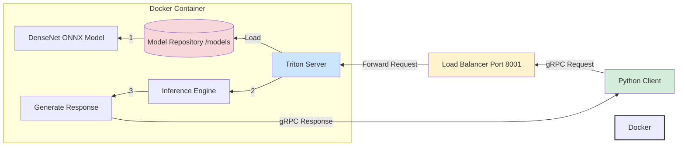

# Triton gRPC Inference Server POC

This repository demonstrates a proof of concept (POC) for using NVIDIA's Triton Inference Server with gRPC protocol. The example uses a DenseNet ONNX model for inference.




## Project Structure

```
models/
└── densenet_onnx
    ├── 1
    │   ├── config.pbtxt
    │   └── model.onnx
    └── densenet_labels.txt
```

## Prerequisites

- Docker
- Python 3.x
- `tritonclient` Python package

## Setup and Installation

1. Install the required Python package:
```bash
pip install tritonclient[all]
```

2. Ensure your model files are organized in the structure shown above.

## Starting the Triton Server

Use the provided script `start_triton_server.sh` to start the Triton server in a Docker container:

```bash
docker run --rm -p 8000:8000 -p 8001:8001 -p 8002:8002 \
    -v $(pwd)/models:/models \
    nvcr.io/nvidia/tritonserver:24.11-py3 \
    tritonserver --model-repository=/models
```

This command:
- Maps ports 8000 (HTTP), 8001 (gRPC), and 8002 (metrics)
- Mounts your local models directory to the container
- Uses NVIDIA's Triton server image version 24.11

## Usage

### Checking Model Metadata

```python
import tritonclient.grpc as grpcclient

TRITON_GRPC_URL = "localhost:8001"
model_name = "densenet_onnx"

try:
    triton_client = grpcclient.InferenceServerClient(url=TRITON_GRPC_URL)
    model_metadata = triton_client.get_model_metadata(model_name)
    print(f"Model Metadata:\n{model_metadata}")
except Exception as e:
    print(f"Error retrieving model metadata: {e}")
```

### Making Inference Requests

```python
import numpy as np
import tritonclient.grpc as grpcclient
from tritonclient.utils import np_to_triton_dtype

# Server configuration
TRITON_GRPC_URL = "localhost:8001"
model_name = "densenet_onnx"
input_name = "data_0"
output_name = "fc6_1"
input_shape = [1, 3, 224, 224]

# Initialize client
triton_client = grpcclient.InferenceServerClient(url=TRITON_GRPC_URL)

# Prepare input data
input_data = np.random.rand(*input_shape).astype(np.float32)
inputs = [
    grpcclient.InferInput(input_name, input_shape, np_to_triton_dtype(input_data.dtype))
]
inputs[0].set_data_from_numpy(input_data)

# Define outputs
outputs = [grpcclient.InferRequestedOutput(output_name)]

# Make inference request
response = triton_client.infer(model_name=model_name, inputs=inputs, outputs=outputs)
output_data = response.as_numpy(output_name)
```

## Model Details

- Model: DenseNet (ONNX format)
- Input Shape: [1, 3, 224, 224] (batch_size, channels, height, width)
- Input Type: FP32
- Output Shape: [1, 1000, 1, 1]
- Output Type: FP32

## Port Configuration

- 8000: HTTP endpoint
- 8001: gRPC endpoint
- 8002: Metrics endpoint

## Notes

- The model expects input images in RGB format with shape [1, 3, 224, 224]
- Input values should be normalized between 0 and 1
- The output is a 1000-dimensional vector representing class probabilities

## Troubleshooting

1. If you cannot connect to the server, ensure:
   - The Docker container is running
   - Ports are properly mapped
   - No firewall is blocking the connections

2. If the model fails to load, verify:
   - The model directory structure is correct
   - The config.pbtxt file is properly formatted
   - The model.onnx file is valid

## License

[Specify your license here]

## Contributing

[Add contribution guidelines if applicable]
