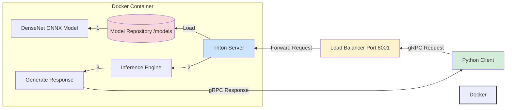

```mermaid
flowchart RL
    Client[Python Client] -->|gRPC Request| LoadBalancer[Load Balancer Port 8001]
    LoadBalancer -->|Forward Request| TritonServer[Triton Server]
    
    subgraph Docker Container
        TritonServer -->|Load| ModelRepo[(Model Repository /models)]
        ModelRepo -->|1| DenseNet[DenseNet ONNX Model]
        TritonServer -->|2| InferenceEngine[Inference Engine]
        InferenceEngine -->|3| Response[Generate Response]
    end
    
    Response -->|gRPC Response| Client
    
    style Docker Container fill:#f5f5f5,stroke:#333,stroke-width:2px
    style Client fill:#d4edda
    style LoadBalancer fill:#fff3cd
    style TritonServer fill:#cce5ff
    style ModelRepo fill:#f8d7da
```
