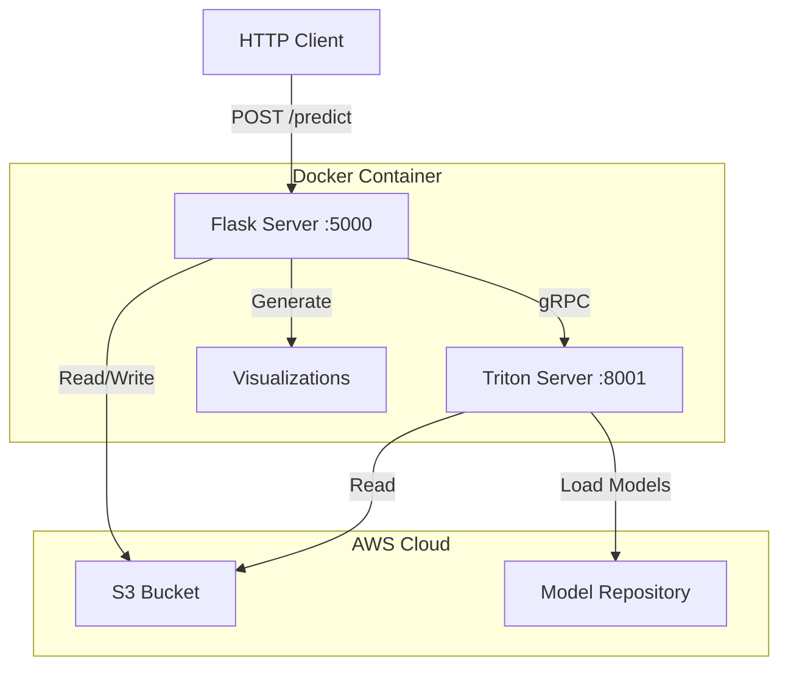
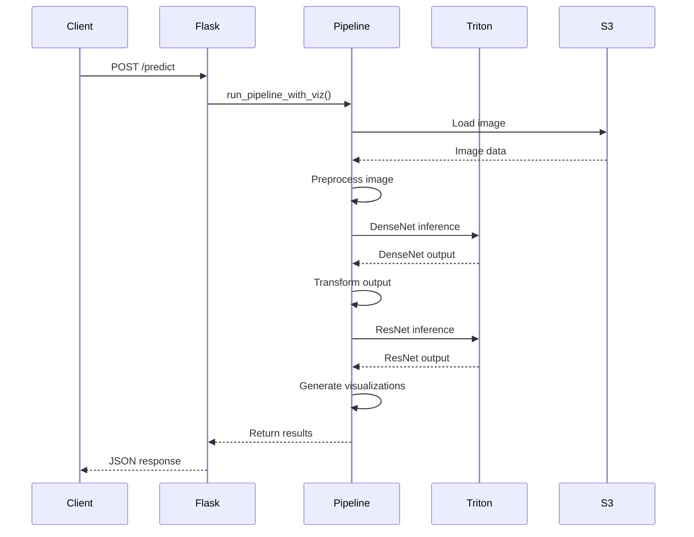

# Vision Pipeline with Triton Inference Server

## System Architecture



## Pipeline Flow



## Project Structure

```
vision-pipeline/
├── Dockerfile
├── requirements.txt
├── monitoring.py
├── pipeline.py
├── serve.py
└── README.md
```

## Prerequisites

- Docker
- AWS credentials with S3 access
- S3 bucket containing:
  - Input images
  - Model repository with DenseNet and ResNet models
- GPU support (optional)

## Quick Start

1. Clone the repository:
```bash
git clone <repository-url>
cd vision-pipeline
```

2. Create requirements.txt:
```
tritonclient[all]
Flask
boto3
Pillow
torch
torchvision
matplotlib
seaborn
numpy
```

3. Build the Docker image:
```bash
docker build -t vision-pipeline .
```

4. Run the container:
```bash
docker run -p 5000:5000 -p 8000:8000 -p 8001:8001 -p 8002:8002 \
-e AWS_ACCESS_KEY_ID=your_access_key \
-e AWS_SECRET_ACCESS_KEY=your_secret_key \
-e AWS_DEFAULT_REGION=us-east-1 \
vision-pipeline
```

## API Endpoints

### Health Check
```bash
curl http://localhost:5000/
```

Response:
```json
{
  "status": "healthy",
  "services": {
    "flask": true,
    "triton": true
  }
}
```

### Predict
```bash
curl -X POST http://localhost:5000/predict \
-H "Content-Type: application/json" \
-d '{"s3_key": "images/test-image.jpg"}'
```

Response:
```json
{
  "densenet_output": [...],
  "resnet_output": [...],
  "visualization_dir": "visualization_outputs_YYYYMMDD_HHMMSS",
  "processing_time": 1.234
}
```

## Monitoring and Debugging

### View Container Logs
```bash
docker logs <container_id>
```

### Access Container Shell
```bash
docker exec -it <container_id> /bin/bash
```

### Check Triton Metrics
```bash
curl http://localhost:8002/metrics
```

### Monitor Pipeline Steps
The system includes comprehensive monitoring with the `@pipeline_monitor` decorator that tracks:
- S3 image loading
- Image preprocessing
- Model inference
- Visualization generation
- Timing for each step

## Configuration

### Environment Variables
- `AWS_ACCESS_KEY_ID`: AWS access key
- `AWS_SECRET_ACCESS_KEY`: AWS secret key
- `AWS_DEFAULT_REGION`: AWS region
- `CUDA_VISIBLE_DEVICES`: GPU device selection
- `S3_BUCKET`: S3 bucket name (default: dry-bean-bucket-c)

### Ports
- 5000: Flask API
- 8000: Triton HTTP
- 8001: Triton gRPC
- 8002: Triton Metrics

## Troubleshooting

### Common Issues

1. S3 Access Issues
```bash
# Test S3 access from container
aws s3 ls s3://your-bucket/
```

2. Triton Server Connection
```bash
# Check if Triton is running
curl http://localhost:8000/v2/health/ready
```

3. GPU Issues
```bash
# Check GPU visibility
nvidia-smi
```

4. Pipeline Hanging
- Check container logs for timeouts
- Verify S3 object exists
- Check model availability in repository

### Error Messages and Solutions

| Error | Solution |
|-------|----------|
| "S3 access error" | Check AWS credentials and bucket permissions |
| "Timeout waiting for Triton server" | Verify model repository path and accessibility |
| "Pipeline execution failed" | Check logs for specific step failure |
| "Invalid JSON" | Verify request format and content type |


# Code

serve.py
```python
from flask import Flask, request, jsonify
from pipeline import TritonS3VisionPipeline
import os
import logging
import time
import sys
import traceback

# Enhanced logging configuration
logging.basicConfig(
    level=logging.DEBUG,
    format='%(asctime)s - %(name)s - %(levelname)s - %(message)s',
    stream=sys.stdout
)
logger = logging.getLogger(__name__)

app = Flask(__name__)

def wait_for_triton(timeout=60):
    start_time = time.time()
    while True:
        try:
            logger.debug("Attempting to connect to Triton server...")
            pipeline = TritonS3VisionPipeline(
                triton_url='localhost:8001',
                s3_bucket=os.getenv('S3_BUCKET', 'dry-bean-bucket-c')
            )
            logger.debug("Successfully connected to Triton server")
            return pipeline
        except Exception as e:
            if time.time() - start_time > timeout:
                logger.error(f"Timeout waiting for Triton server: {str(e)}")
                raise Exception(f"Timeout waiting for Triton server: {str(e)}")
            logger.debug(f"Waiting for Triton server... Error: {str(e)}")
            time.sleep(5)

# Initialize pipeline with retry
logger.info("Starting Triton server initialization...")
try:
    pipeline = wait_for_triton()
    logger.info("Triton server initialization complete")
except Exception as e:
    logger.error(f"Failed to initialize Triton server: {str(e)}")
    sys.exit(1)

@app.route('/predict', methods=['POST'])
def predict():
    request_start_time = time.time()
    logger.info(f"Received prediction request at {request_start_time}")
    
    try:
        # Log request headers
        logger.debug(f"Request headers: {dict(request.headers)}")
        
        # Get and validate JSON data
        try:
            data = request.get_json()
            logger.debug(f"Parsed request data: {data}")
        except Exception as e:
            logger.error(f"Failed to parse JSON: {str(e)}")
            return jsonify({'error': 'Invalid JSON'}), 400
            
        if not data:
            logger.error("Empty request data")
            return jsonify({'error': 'Empty request'}), 400
            
        if 's3_key' not in data:
            logger.error("Missing s3_key in request")
            return jsonify({'error': 'Missing s3_key'}), 400
        
        s3_key = data['s3_key']
        logger.info(f"Starting processing for S3 key: {s3_key}")
        
        # Test S3 access before processing
        try:
            logger.debug("Testing S3 bucket access...")
            pipeline.s3.head_object(Bucket=pipeline.bucket, Key=s3_key)
            logger.debug("S3 bucket access successful")
        except Exception as e:
            logger.error(f"S3 access error: {str(e)}")
            return jsonify({'error': f'S3 access error: {str(e)}'}), 500
        
        # Run pipeline with detailed timing
        logger.info("Starting pipeline execution")
        pipeline_start = time.time()
        try:
            densenet_output, resnet_output = pipeline.run_pipeline_with_viz(s3_key)
            pipeline_duration = time.time() - pipeline_start
            logger.info(f"Pipeline execution completed in {pipeline_duration:.2f} seconds")
        except Exception as e:
            logger.error(f"Pipeline execution failed: {str(e)}")
            logger.error(f"Traceback: {traceback.format_exc()}")
            return jsonify({'error': f'Pipeline execution failed: {str(e)}'}), 500
        
        # Prepare response
        try:
            result = {
                'densenet_output': densenet_output.tolist(),
                'resnet_output': resnet_output.tolist(),
                'visualization_dir': pipeline.output_dir,
                'processing_time': pipeline_duration
            }
        except Exception as e:
            logger.error(f"Error preparing response: {str(e)}")
            return jsonify({'error': 'Error preparing response'}), 500
        
        total_duration = time.time() - request_start_time
        logger.info(f"Request completed in {total_duration:.2f} seconds")
        return jsonify(result)
    
    except Exception as e:
        logger.error(f"Unexpected error: {str(e)}")
        logger.error(f"Traceback: {traceback.format_exc()}")
        return jsonify({'error': str(e)}), 500

if __name__ == "__main__":
    logger.info("Starting Flask application")
    app.run(host='0.0.0.0', port=5000, threaded=True)
```

pipeline.py
```python
import numpy as np
import boto3
import io
from tritonclient.grpc import InferenceServerClient, InferInput, InferRequestedOutput
from PIL import Image
import torchvision.transforms as transforms
import logging
import matplotlib.pyplot as plt
import seaborn as sns
from torchvision.utils import make_grid
import torch
import os
from datetime import datetime
from monitoring import pipeline_monitor

logging.basicConfig(level=logging.INFO)
logger = logging.getLogger(__name__)

# Configure logging
logging.basicConfig(level=logging.INFO)
logger = logging.getLogger(__name__)

class TritonS3VisionPipeline:
    def __init__(self, s3_bucket="dry-bean-bucket-c", triton_url='localhost:8001'):
        self.client = InferenceServerClient(url=triton_url)
        self.s3 = boto3.client('s3')
        self.bucket = s3_bucket
        
        self.preprocess = transforms.Compose([
            transforms.Resize(256),
            transforms.CenterCrop(224),
            transforms.ToTensor(),
            transforms.Normalize(
                mean=[0.485, 0.456, 0.406],
                std=[0.229, 0.224, 0.225]
            )
        ])
        
        self.models = {
            "densenet": {"model_name": "densenet_onnx", "input_name": "data_0", "output_name": "fc6_1"},
            "resnet": {"model_name": "resnet50_onnx", "input_name": "data", "output_name": "resnetv24_dense0_fwd"}
        }

        # Get model configurations from Triton
        self.models = self.get_model_configurations()


        
        # Create output directory with timestamp
        self.timestamp = datetime.now().strftime("%Y%m%d_%H%M%S")
        self.output_dir = f"visualization_outputs_{self.timestamp}"
        os.makedirs(self.output_dir, exist_ok=True)
        logger.info(f"Created output directory: {self.output_dir}")

    def get_model_configurations(self):
        """Fetch model configurations from Triton server."""
        try:
            model_configs = {}

            # Get DenseNet configuration
            densenet_metadata = self.client.get_model_metadata("densenet_onnx", "1")
            densenet_config = self.client.get_model_config("densenet_onnx", "1")

            # Get ResNet configuration
            resnet_metadata = self.client.get_model_metadata("resnet50_onnx", "1")
            resnet_config = self.client.get_model_config("resnet50_onnx", "1")

            model_configs["densenet"] = {
                "model_name": "densenet_onnx",
                "input_name": densenet_metadata.inputs[0].name,
                "output_name": densenet_metadata.outputs[0].name
            }

            model_configs["resnet"] = {
                "model_name": "resnet50_onnx",
                "input_name": resnet_metadata.inputs[0].name,
                "output_name": resnet_metadata.outputs[0].name
            }

            logger.info("Successfully fetched model configurations from Triton")
            return model_configs

        except Exception as e:
            logger.error(f"Error fetching model configurations: {str(e)}")
            logger.warning("Falling back to default configurations")

            # Fallback to default configurations
            return {
                "densenet": {
                    "model_name": "densenet_onnx",
                    "input_name": "data_0",
                    "output_name": "fc6_1"
                },
                "resnet": {
                    "model_name": "resnet50_onnx",
                    "input_name": "data",
                    "output_name": "resnetv24_dense0_fwd"
                }
            }

    def load_image_from_s3(self, s3_key):
        logger.info(f"Loading image from S3: {s3_key}")
        response = self.s3.get_object(Bucket=self.bucket, Key=s3_key)
        image_bytes = response['Body'].read()
        image = Image.open(io.BytesIO(image_bytes)).convert('RGB')
        return image

    def preprocess_image(self, image):
        logger.info("Preprocessing image")
        img_tensor = self.preprocess(image)
        return img_tensor.numpy()[None, ...]

    def process_model(self, input_data, model_config):
        logger.info(f"Processing with model: {model_config['model_name']}")
        inputs = [InferInput(model_config['input_name'], input_data.shape, "FP32")]
        inputs[0].set_data_from_numpy(input_data)
        outputs = [InferRequestedOutput(model_config['output_name'])]
        response = self.client.infer(model_config['model_name'], inputs, outputs=outputs)
        return response.as_numpy(model_config['output_name'])

    def transform_densenet_output(self, densenet_output):
        logger.info("Transforming DenseNet output for ResNet input")
        target_shape = (1, 3, 224, 224)
        target_elements = np.prod(target_shape)
        flattened = densenet_output.flatten()
        if flattened.size < target_elements:
            padded = np.pad(flattened, (0, target_elements - flattened.size), mode='constant')
        elif flattened.size > target_elements:
            raise ValueError(f"DenseNet output size exceeds ResNet input size: {target_elements}")
        reshaped = padded.reshape(target_shape)
        return reshaped

    def visualize_preprocessing_steps(self, original_image):
        """Visualize each step of the preprocessing pipeline."""
        plt.figure(figsize=(20, 5))
        
        # Original image
        plt.subplot(1, 4, 1)
        plt.imshow(original_image)
        plt.title("Original Image")
        plt.axis('off')
        
        # After resize
        resize_transform = transforms.Resize(256)
        resized_img = resize_transform(original_image)
        plt.subplot(1, 4, 2)
        plt.imshow(resized_img)
        plt.title("After Resize (256)")
        plt.axis('off')
        
        # After center crop
        crop_transform = transforms.CenterCrop(224)
        cropped_img = crop_transform(resized_img)
        plt.subplot(1, 4, 3)
        plt.imshow(cropped_img)
        plt.title("After Center Crop (224)")
        plt.axis('off')
        
        # After normalization
        tensor_transform = transforms.ToTensor()
        normalize_transform = transforms.Normalize(
            mean=[0.485, 0.456, 0.406],
            std=[0.229, 0.224, 0.225]
        )
        tensor_img = tensor_transform(cropped_img)
        normalized_img = normalize_transform(tensor_img)
        
        # Convert normalized tensor back to viewable image
        img_for_display = normalized_img.clone()
        for t, m, s in zip(img_for_display, [0.485, 0.456, 0.406], [0.229, 0.224, 0.225]):
            t.mul_(s).add_(m)
        
        plt.subplot(1, 4, 4)
        plt.imshow(img_for_display.permute(1, 2, 0).numpy())
        plt.title("After Normalization")
        plt.axis('off')
        
        # Save the visualization
        filename = os.path.join(self.output_dir, 'preprocessing_steps.png')
        plt.savefig(filename, bbox_inches='tight', dpi=300)
        plt.close()
        logger.info(f"Saved preprocessing steps visualization to {filename}")

    def visualize_feature_maps(self, tensor, title, max_features=16):
        """Visualize feature maps from the model outputs and save to file."""
        # Convert numpy array to torch tensor if needed
        if isinstance(tensor, np.ndarray):
            tensor = torch.from_numpy(tensor)
        
        # Reshape if necessary
        if len(tensor.shape) == 2:
            tensor = tensor.unsqueeze(0).unsqueeze(0)
        elif len(tensor.shape) == 3:
            tensor = tensor.unsqueeze(0)
            
        # Select a subset of features to visualize
        n_features = min(tensor.shape[1], max_features)
        features = tensor[0, :n_features]
        
        # Normalize features for visualization
        features = features - features.min()
        features = features / features.max()
        
        # Create grid
        grid = make_grid(features.unsqueeze(1), nrow=4, padding=2, normalize=True)
        
        # Plot and save
        plt.figure(figsize=(15, 15))
        plt.imshow(grid.numpy().transpose((1, 2, 0)), cmap='viridis')
        plt.title(f'{title} - Feature Maps')
        plt.axis('off')
        
        # Save the plot
        filename = os.path.join(self.output_dir, f'{title.lower()}_feature_maps.png')
        plt.savefig(filename, bbox_inches='tight', dpi=300)
        plt.close()
        logger.info(f"Saved feature maps to {filename}")

    def visualize_activation_heatmap(self, tensor, title):
        """Create a heatmap visualization of the activation values and save to file."""
        # If tensor is multi-dimensional, take the mean across all but the last two dimensions
        if len(tensor.shape) > 2:
            tensor = np.mean(tensor, axis=tuple(range(len(tensor.shape)-2)))
        
        plt.figure(figsize=(12, 8))
        sns.heatmap(tensor, cmap='viridis', center=0)
        plt.title(f'{title} - Activation Heatmap')
        
        # Save the plot
        filename = os.path.join(self.output_dir, f'{title.lower()}_heatmap.png')
        plt.savefig(filename, bbox_inches='tight', dpi=300)
        plt.close()
        logger.info(f"Saved heatmap to {filename}")

    def save_original_image(self, image, s3_key):
        """Save the original image."""
        plt.figure(figsize=(8, 8))
        plt.imshow(image)
        plt.title("Original Image")
        plt.axis('off')
        
        # Extract filename from S3 key
        image_name = os.path.basename(s3_key).split('.')[0]
        filename = os.path.join(self.output_dir, f'original_{image_name}.png')
        plt.savefig(filename, bbox_inches='tight', dpi=300)
        plt.close()
        logger.info(f"Saved original image to {filename}")

    @pipeline_monitor(timeout=300)
    def run_pipeline_with_viz(self, s3_key):
        """Run the pipeline and save visualizations."""
        logger.info("Running vision pipeline with visualizations")
        
        # Load original image
        original_image = self.load_image_from_s3(s3_key)
        
        # Save original image and preprocessing steps
        self.save_original_image(original_image, s3_key)
        self.visualize_preprocessing_steps(original_image)
        
        # Get model outputs
        processed_image = self.preprocess_image(original_image)
        
        # Process and visualize DenseNet
        densenet_output = self.process_model(processed_image, self.models['densenet'])
        self.visualize_feature_maps(densenet_output, "DenseNet")
        self.visualize_activation_heatmap(densenet_output, "DenseNet")
        
        # Transform DenseNet output for ResNet input
        transformed_input = self.transform_densenet_output(densenet_output)
        
        # Process and visualize ResNet
        resnet_output = self.process_model(transformed_input, self.models['resnet'])
        self.visualize_feature_maps(resnet_output, "ResNet")
        self.visualize_activation_heatmap(resnet_output, "ResNet")
        
        logger.info(f"All visualizations have been saved to directory: {self.output_dir}")
        return densenet_output, resnet_output

# Example usage
if __name__ == "__main__":
    pipeline = TritonS3VisionPipeline()
    s3_key = "images/pexels-pixabay-45201.jpg"
    densenet_output, resnet_output = pipeline.run_pipeline_with_viz(s3_key)
```
monitoring.py
```python
import logging
from functools import wraps
import time
from typing import Optional, Tuple, Any
import numpy as np

def pipeline_monitor(timeout: int = 300):
    def decorator(func):
        @wraps(func)
        def wrapper(self, s3_key: str, *args, **kwargs) -> Tuple[np.ndarray, np.ndarray]:
            start_time = time.time()
            status = {
                's3_load': False,
                'preprocessing': False,
                'densenet': False,
                'transformation': False,
                'resnet': False,
                'visualization': False
            }
            
            try:
                # 1. S3 Image Loading
                logging.info(f"Loading image from S3: {s3_key}")
                original_image = self.load_image_from_s3(s3_key)
                status['s3_load'] = True
                
                # 2. Preprocessing
                logging.info("Preprocessing image")
                processed_image = self.preprocess_image(original_image)
                status['preprocessing'] = True
                
                # 3. DenseNet Processing
                logging.info("Running DenseNet inference")
                densenet_output = self.process_model(processed_image, self.models['densenet'])
                status['densenet'] = True
                
                # 4. Transform DenseNet Output
                logging.info("Transforming DenseNet output")
                transformed_input = self.transform_densenet_output(densenet_output)
                status['transformation'] = True
                
                # 5. ResNet Processing
                logging.info("Running ResNet inference")
                resnet_output = self.process_model(transformed_input, self.models['resnet'])
                status['resnet'] = True
                
                # 6. Visualizations
                logging.info("Generating visualizations")
                self.save_original_image(original_image, s3_key)
                self.visualize_preprocessing_steps(original_image)
                self.visualize_feature_maps(densenet_output, "DenseNet")
                self.visualize_feature_maps(resnet_output, "ResNet")
                status['visualization'] = True
                
                execution_time = time.time() - start_time
                logging.info(f"Pipeline completed successfully in {execution_time:.2f} seconds")
                return densenet_output, resnet_output
                
            except Exception as e:
                execution_time = time.time() - start_time
                failed_step = next((step for step, completed in status.items() if not completed), "unknown")
                logging.error(f"Pipeline failed at step '{failed_step}' after {execution_time:.2f} seconds")
                logging.error(f"Error details: {str(e)}")
                
                if execution_time > timeout:
                    logging.error(f"Pipeline timed out after {timeout} seconds")
                    raise TimeoutError(f"Pipeline execution exceeded {timeout} seconds")
                
                raise RuntimeError(f"Pipeline failed at {failed_step}: {str(e)}")
                
        return wrapper
    return decorator
```

Dockerfile
```Dockerfile
FROM <account_id>.dkr.ecr.us-east-1.amazonaws.com/triton-grpc:24.11-py3 

# Install additional Python packages
COPY requirements.txt /app/requirements.txt
RUN pip install -r /app/requirements.txt
RUN pip install awscli

# Copy application code
COPY monitoring.py /app/monitoring.py
COPY pipeline.py /app/pipeline.py
COPY serve.py /app/serve.py

# Set working directory
WORKDIR /app

# Environment variables for Triton
ENV CUDA_VISIBLE_DEVICES=0
ENV PATH="/usr/local/bin:${PATH}"

# Default command to start both Triton server and Flask API
CMD ["bash", "-c", "tritonserver --model-repository=s3://dry-bean-bucket-c/models --http-port=8000 --grpc-port=8001 --metrics-port=8002 & python3 serve.py"]
```

test_request.json
```json
{
  "s3_key": "images/pexels-pixabay-45201.jpg"
}
```


Build and run the Triton Image with the Pipeline:
```bash
aws ecr get-login-password --region us-east-1 | docker login --username AWS --password-stdin <account_id>.dkr.ecr.us-east-1.amazonaws.com
docker build -t triton-pipeline .
docker run -p 5000:5000 -p 8000:8000 -p 8001:8001 -p 8002:8002 -v ~/.aws:/root/.aws triton-pipeline
```

Sample Log Output:
```bash
+-------------+-----------------------------------------------------------------+---------------------------------------------------------------------------------------------------------------------------------------------------------------+
| Backend     | Path                                                            | Config                                                                                                                                                        |
+-------------+-----------------------------------------------------------------+---------------------------------------------------------------------------------------------------------------------------------------------------------------+
| onnxruntime | /opt/tritonserver/backends/onnxruntime/libtriton_onnxruntime.so | {"cmdline":{"auto-complete-config":"true","backend-directory":"/opt/tritonserver/backends","min-compute-capability":"6.000000","default-max-batch-size":"4"}} |
+-------------+-----------------------------------------------------------------+---------------------------------------------------------------------------------------------------------------------------------------------------------------+

I0110 03:21:50.566950 95 server.cc:674] 
+---------------+---------+--------+
| Model         | Version | Status |
+---------------+---------+--------+
| chrisnet_onnx | 1       | READY  |
| densenet_onnx | 1       | READY  |
| resnet50_onnx | 1       | READY  |
+---------------+---------+--------+
```
To tail the logs:
```bash
docker logs -f d1b7
```

To run the pipeline:
```bash
curl -X POST -H "Content-Type: application/json"   -d '{"s3_key":"images/pexels-pixabay-45201.jpg"}'   --max-time 30 http://localhost:5000/predict
```

Sample log output:
```bash
INFO:__main__:Received prediction request at 1736479614.8651419
INFO:__main__:Starting processing for S3 key: images/pexels-pixabay-45201.jpg
INFO:__main__:Starting pipeline execution
INFO:root:Loading image from S3: images/pexels-pixabay-45201.jpg
INFO:pipeline:Loading image from S3: images/pexels-pixabay-45201.jpg
INFO:root:Preprocessing image
INFO:pipeline:Preprocessing image
INFO:root:Running DenseNet inference
INFO:pipeline:Processing with model: densenet_onnx
INFO:root:Transforming DenseNet output
INFO:pipeline:Transforming DenseNet output for ResNet input
INFO:root:Running ResNet inference
INFO:pipeline:Processing with model: resnet50_onnx
INFO:root:Generating visualizations
INFO:pipeline:Saved original image to visualization_outputs_20250110_032155/original_pexels-pixabay-45201.png
INFO:pipeline:Saved preprocessing steps visualization to visualization_outputs_20250110_032155/preprocessing_steps.png
/app/pipeline.py:188: UserWarning: The given NumPy array is not writable, and PyTorch does not support non-writable tensors. This means writing to this tensor will result in undefined behavior. You may want to copy the array to protect its data or make it writable before converting it to a tensor. This type of warning will be suppressed for the rest of this program. (Triggered internally at ../torch/csrc/utils/tensor_numpy.cpp:206.)
  tensor = torch.from_numpy(tensor)
INFO:pipeline:Saved feature maps to visualization_outputs_20250110_032155/densenet_feature_maps.png
INFO:pipeline:Saved feature maps to visualization_outputs_20250110_032155/resnet_feature_maps.png
INFO:root:Pipeline completed successfully in 23.01 seconds
INFO:__main__:Pipeline execution completed in 23.02 seconds
INFO:__main__:Request completed in 23.21 seconds
```


## Development and Testing

1. Run with debug logging:
```bash
docker run -e LOG_LEVEL=DEBUG ...
```

2. Test individual components:
```bash
# Test S3 access
aws s3 ls s3://your-bucket/

# Test Triton
curl http://localhost:8000/v2/health/ready

# Test Flask
curl http://localhost:5000/
```

3. Monitor pipeline execution:
```bash
# View real-time logs
docker logs -f <container_id>
```

## License

[Your License]

## Contributing

[Contribution Guidelines]
