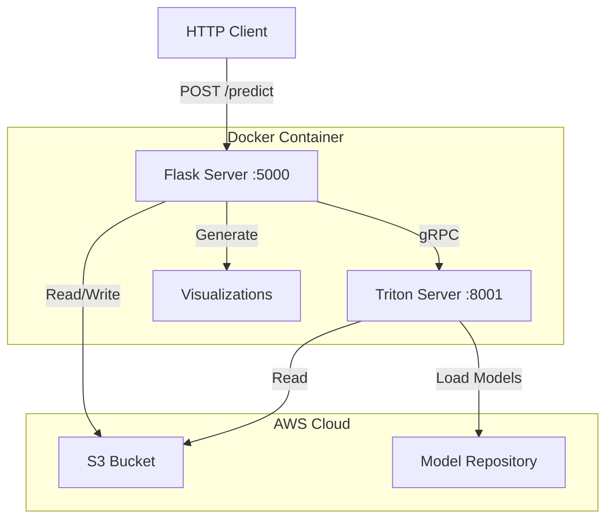
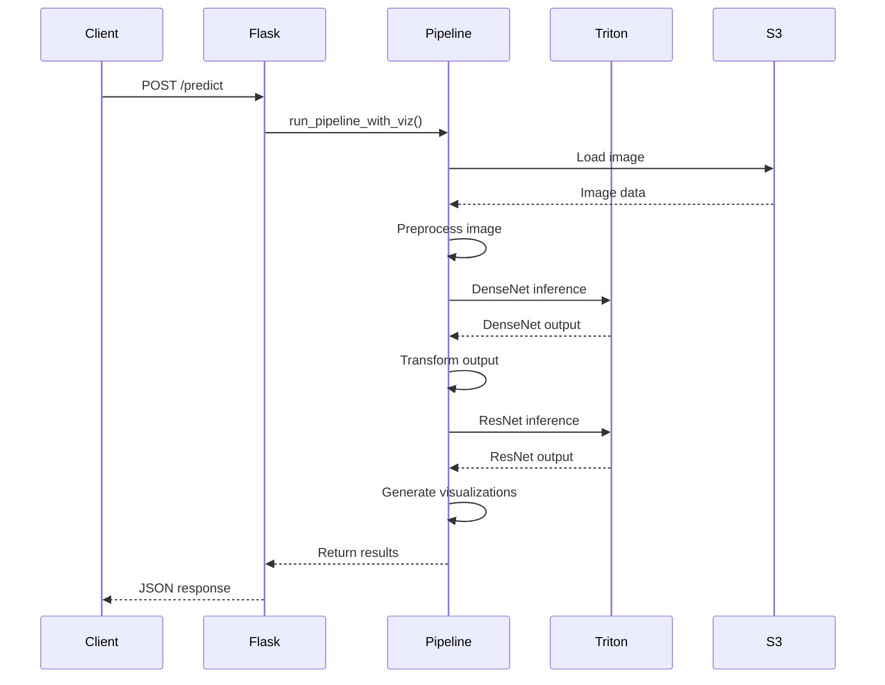

# Vision Pipeline with Triton Inference Server

## System Architecture



## Pipeline Flow



## Project Structure

```
vision-pipeline/
├── Dockerfile
├── requirements.txt
├── monitoring.py
├── pipeline.py
├── serve.py
└── README.md
```

## Prerequisites

- Docker
- AWS credentials with S3 access
- S3 bucket containing:
  - Input images
  - Model repository with DenseNet and ResNet models
- GPU support (optional)

## Quick Start

1. Clone the repository:
```bash
git clone <repository-url>
cd vision-pipeline
```

2. Create requirements.txt:
```
tritonclient[all]
Flask
boto3
Pillow
torch
torchvision
matplotlib
seaborn
numpy
```

3. Build the Docker image:
```bash
docker build -t vision-pipeline .
```

4. Run the container:
```bash
docker run -p 5000:5000 -p 8000:8000 -p 8001:8001 -p 8002:8002 \
-e AWS_ACCESS_KEY_ID=your_access_key \
-e AWS_SECRET_ACCESS_KEY=your_secret_key \
-e AWS_DEFAULT_REGION=us-east-1 \
vision-pipeline
```

## API Endpoints

### Health Check
```bash
curl http://localhost:5000/
```

Response:
```json
{
  "status": "healthy",
  "services": {
    "flask": true,
    "triton": true
  }
}
```

### Predict
```bash
curl -X POST http://localhost:5000/predict \
-H "Content-Type: application/json" \
-d '{"s3_key": "images/test-image.jpg"}'
```

Response:
```json
{
  "densenet_output": [...],
  "resnet_output": [...],
  "visualization_dir": "visualization_outputs_YYYYMMDD_HHMMSS",
  "processing_time": 1.234
}
```

## Monitoring and Debugging

### View Container Logs
```bash
docker logs <container_id>
```

### Access Container Shell
```bash
docker exec -it <container_id> /bin/bash
```

### Check Triton Metrics
```bash
curl http://localhost:8002/metrics
```

### Monitor Pipeline Steps
The system includes comprehensive monitoring with the `@pipeline_monitor` decorator that tracks:
- S3 image loading
- Image preprocessing
- Model inference
- Visualization generation
- Timing for each step

## Configuration

### Environment Variables
- `AWS_ACCESS_KEY_ID`: AWS access key
- `AWS_SECRET_ACCESS_KEY`: AWS secret key
- `AWS_DEFAULT_REGION`: AWS region
- `CUDA_VISIBLE_DEVICES`: GPU device selection
- `S3_BUCKET`: S3 bucket name (default: dry-bean-bucket-c)

### Ports
- 5000: Flask API
- 8000: Triton HTTP
- 8001: Triton gRPC
- 8002: Triton Metrics

## Troubleshooting

### Common Issues

1. S3 Access Issues
```bash
# Test S3 access from container
aws s3 ls s3://your-bucket/
```

2. Triton Server Connection
```bash
# Check if Triton is running
curl http://localhost:8000/v2/health/ready
```

3. GPU Issues
```bash
# Check GPU visibility
nvidia-smi
```

4. Pipeline Hanging
- Check container logs for timeouts
- Verify S3 object exists
- Check model availability in repository

### Error Messages and Solutions

| Error | Solution |
|-------|----------|
| "S3 access error" | Check AWS credentials and bucket permissions |
| "Timeout waiting for Triton server" | Verify model repository path and accessibility |
| "Pipeline execution failed" | Check logs for specific step failure |
| "Invalid JSON" | Verify request format and content type |

## Development and Testing

1. Run with debug logging:
```bash
docker run -e LOG_LEVEL=DEBUG ...
```

2. Test individual components:
```bash
# Test S3 access
aws s3 ls s3://your-bucket/

# Test Triton
curl http://localhost:8000/v2/health/ready

# Test Flask
curl http://localhost:5000/
```

3. Monitor pipeline execution:
```bash
# View real-time logs
docker logs -f <container_id>
```

## License

[Your License]

## Contributing

[Contribution Guidelines]
